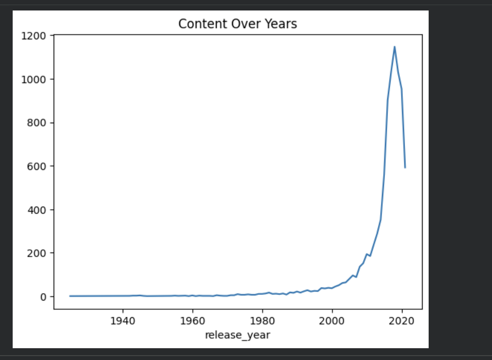

## Netflix Content Analysis & Trend Insights

## Overview
This project analyzes Netflix content to understand trends in movies, TV shows, genres, and global distribution.

##  Key Insights
- Netflix has more movies than TV shows
- Content growth increased significantly after 2015
- The United States dominates content production
- Drama and International genres are most popular
- Analyzed content growth trends to understand Netflix’s global expansion strategy.

## Tools Used
- Python (Pandas)
- Matplotlib
- Google Colab

##  Files
- netflix_analysis.ipynb → complete analysis
- dataset.csv → dataset used

## 📊 Visualization

##  Conclusion
This project highlights Netflix’s content strategy and global expansion trends.
